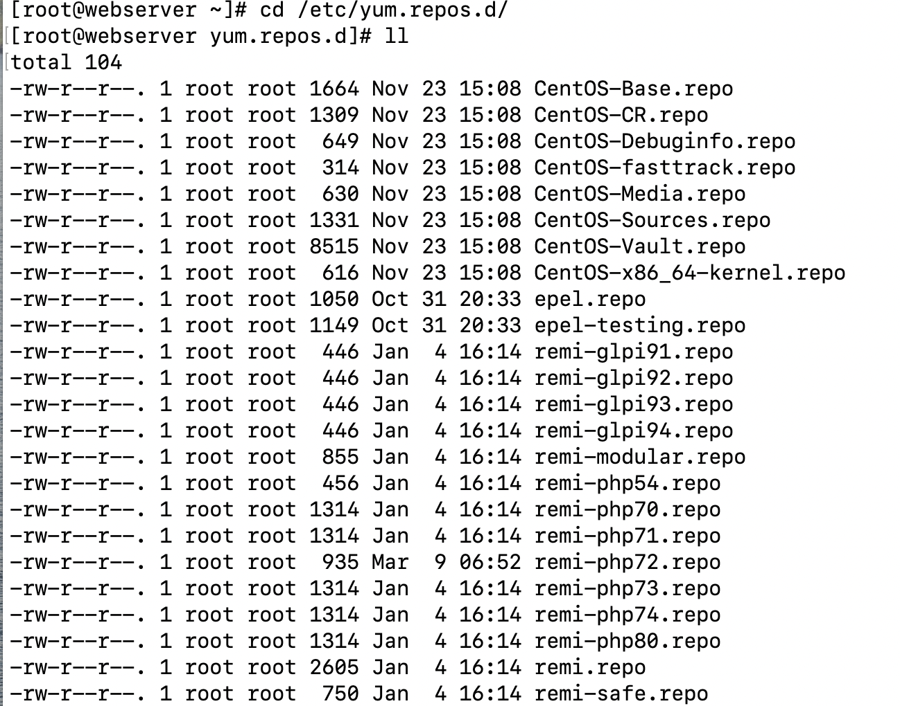

### LAMP stack installation for WordPress

### Resources
  - Webserver Server machine (CentOS 7.6)
  - Database machine (Ubuntu 18.04)

### Description

Installing, updating and removing packages on every distributon of Linux can come with it's own challenges , especially when you just got into IT world. Every Linux distribution has it's own package manager for example, Ubuntu machines uses ```apt```, Red Hat and CentOS uses ```yum``` (yellow dog updater, modifier), Fedora (Red Hat based Linux distro) uses ```yum```and ```dnf```(Dandified yum next generation of yum) and Mac OS uses ```homebrew```. The ways of installing depends on what interface you are comfortable working with GUI, CLI or simply use a tool like an ```Ansible```, and get it done with one playbook.
Working with CentOS 7.6 machine in my case I faced some issues when tried intall a LAMP (Linux, Apache, MySql and PHP) stack, in order to prepare my machine for WordPress website.
Before writing a playbook I trid to do it on command line, then you can see, which steps needs to be taken. The advantage of ansible playbooks is that, once you write a playbook it is reusable, and you can adjust it, depending what package you want to install, just pass it on variables file, without touching an actual playbook.
To start with I installed wget, curl, and vim while my machine was booting and I listed package names that needs to be installed in variables file it's: epel-release, mysql, httpd and used ```yum``` module in my playbook. All went well no issues! Until I installed ```php```...
The installation of ```php``` with ```yum```worked, but the installed version of was older in my case php 5.4 and it's a latest version what ```yum repository``` has.  But the problem is that this version of ```php``` isn't compitable with WordPress, it has to be at least php 5.6 and later. So to fix that issue we need to install third party repositories such as epel-release (Extra Packages for Enterprise Linux) and remi-php72 ( a large collection of RPMS, including latest versions of PHP, Remi Collet is author at Red Hat Developer), where the latest version of php  is 7.2. After installing listed above repositories I was able to install the php 7.2 version and all it's dependencies, as I said earlier first I did it on command line and it looks like this:
```
sudo yum install epel-release
sudo yum install http://rpms.remirepo.net/enterprise/remi-release-7.rpm
sudo yum install yum-utils
sudo yum-config-manager --enable remi-php72
sudo yum update
sudo yum install php72
sudo yum install php72-php-fpm php72-php-gd php72-php-json php72-php-mbstring php72-php-mysqlnd php72-php-xml php72-php-xmlrpc php72-php-opcache
```
After getting to know how the process happens on CLI now you I could write a playbook. Before you do it remove php 5.4 and all dependencies to it by runnig command ```yum remove php* -y```. When you install epel-release  you have to keep in mind that you are istalling not only epel-release repo, but also all the depending packages to it, same with remi-php72. All dependencies get's installed in different places on your machine and the main configuration file for ```yum``` is at /etc/yum.conf, and all the repos are at /etc/yum.repos.d.



As it shown on the example all repository folders are inside of /etc/yum.repos.d. but dependencies of this packages can be in other folders, that's why we run ```php*```.

For a security reasons always update packages to latest versions, in my case I checked all  installed packages versions, before to download the Wordpress it is important , you need to make sure that  all packages are compatible with each other.
```
ansible -i inventory.yaml webserver -m command -a "mysql --version"
ansible -i inventory.yaml webserver -m command -a "httpd -v"
ansible -i inventory.yaml webserver -m command -a "php72 --version"
ansible -i inventory.yaml database -m command -a "mariadb --version"
ansible -i inventory.yaml database -m command -a "mysql --version"
ansible -i inventory.yaml webserver -m command -a "mysql --version"
```
Output from that commands: 
```
Server version: Apache/2.4.6 (CentOS)
PHP 7.2.34 (cli)

mariadb  Ver 15.1 
mysql client:

database | CHANGED | rc=0 >>
mysql  Ver 15.1 Distrib 10.1.47-MariaDB, for debian-linux-gnu (x86_64) using readline 5.2


webserver | CHANGED | rc=0 >>
mysql  Ver 15.1 Distrib 5.5.68-MariaDB, for Linux (x86_64) using readline 5.1
```
For ```database``` machine we have to install mariadb-server, which will be connecnted with ```webserver``` machine. Now all packages are installed we can install WordPress

### Useful Links

[Fedora distribution package manager](https://fedoraproject.org/wiki/DNF?rd=RPM)

[Linux package management with YUM and RPM](https://www.redhat.com/sysadmin/how-manage-packages)

[LAMP stack installation on CentOS 7 with liquidweb](https://www.liquidweb.com/kb/install-lamp-stack-centos-7/)

[LAMP stack installation on CentOS 7 with linuxize](https://linuxize.com/series/install-lamp-stack-on-centos-7/)

[Remi repository](http://rpms.remirepo.net/)

[Epel-release repository](https://fedoraproject.org/wiki/EPEL)

[PHP Installation](https://www.scriptcase.net/docs/en_us/v9/manual/02-scriptcase-installation/06-linux_php/)

### Notes

When you want to install a package from repository like ```yum``` make sure to update it first, that way your packages will be up to date.
Remember that WordPress 5.7 is not compitable with PHP 7.2, that's why it didn't work.
